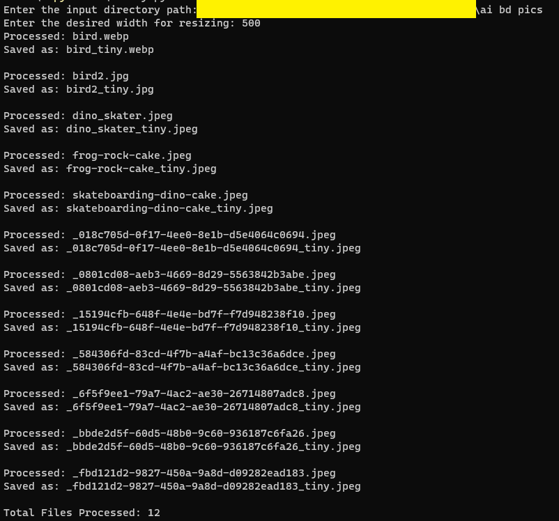

# tinyfi
Compresses and resizes images in a folder

The script will ask you to specify the path to the folder containing images you want to tinyfi. You can then specify the width of the image. It will keep the aspect ratio.

A copy of your image will be created and the suffix _tiny will be appended to the image name. This makes it non-destructive and you (and the script) can easily identify which images have already been processed.

